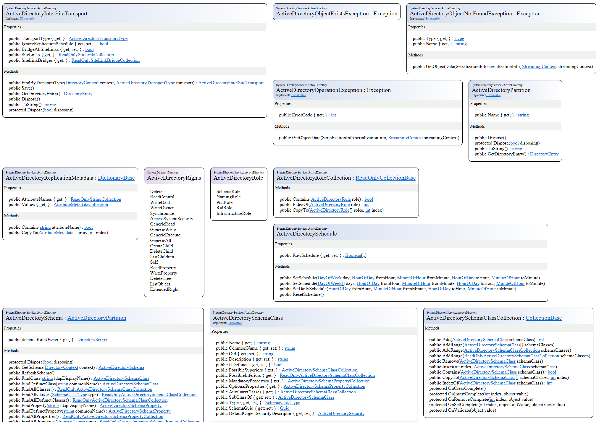

# .NET Object Model Diagram Generator

A cross-platform Roslyn-based tool that generates an object model diagram of a set of C# source files 

### Install

Run the following command from commandline (requires .NET Core 2.1 installed):
```
dotnet tool install --global dotMorten.OmdGenerator
```


### Usage:
```
generateomd /source=[source folder] /compareSource=[oldSourceFolder] /preprocessors=[defines] /format=[html|image] /showPrivate /showInternal

Required parameters:
  source            Specifies the folder of source files to include for the object model.
                    Separate with ; for multiple folders
or
  assemblies        Specifies a set of assemblies to include for the object model.
                    Separate with ; for multiple assemblies, or use wildcards
				
Optional parameters:
  compareSource     Specifies a folder of old source to compare and generate a diff model
                    This can be useful for finding API changes or compare branches
  compareAssemblies Specifies a set of old assemblies to compare and generate a adiff model.
                    Separate with; for multiple assemblies, or use wildcards
  format            Format to generate: 
                       'html' a single html output (html is default)
                       'md' for markdown you can copy-paste to for instance GitHub
  preprocessors     Define a set of preprocessors values. Use ; to separate multiple
  exclude           Defines one or more strings that can't be part of the path Ie '*/Samples/*;*/UnitTests/*'
                    (use forward slash for folder separators)
  regexfilter       Defines a regular expression for filtering on full file names in the source
  showPrivate       Show private members (default is false)
  showInternal      Show internal members (default is false)
```


### NuGet
As an alternative you can also reference a [NuGet package](https://www.nuget.org/packages/dotMorten.OmdGenerator/) to your class library, and set up a post-build script to generate an Object Model Diagram HTML file:

```
Install-Package dotMorten.OmdGenerator 
```

Add the following to your project:
```xml
  <Target Name="GenerateObjectModel">
    <Exec Command="dotnet &quot;$(DotNetOMDGeneratorToolPath)&quot; /source=&quot;@(Compile)&quot; /preprocessors=&quot;$(DefineConstants)&quot; /output=&quot;$(OutputPath)$(TargetName).html&quot;" WorkingDirectory="$(ProjectDir)" />
  </Target>
 
```


An example of a generated output for all of .NET Core can be found [here](http://www.sharpgis.net/Tests/corefx.html).

It can also be used to compare two folders (for instance two separate branches) and only show changes to the API. [Here's an example of .NET CoreFX v2.0 vs Master](http://www.sharpgis.net/Tests/corefx_new.html).

[](http://www.sharpgis.net/Tests/corefx.html)


### Examples

Generate OMD for .NET Core FX source code, and ignore ref and test folders:
```
dotnet Generator.dll /source=c:\github\dotnet\corefx\src /exclude="*/ref/*;*/tests/*;*/perftests/*"
```

Compare .NET CoreFX Master with v2.0.0 repo branches directly from their Github zipped downloads:

```
dotnet Generator.dll /source=https://github.com/dotnet/corefx/archive/master.zip /compareSource=https://github.com/dotnet/corefx/archive/release/2.0.0.zip /exclude="*/ref/*;*/tests/*;*/perftests/*"
```


