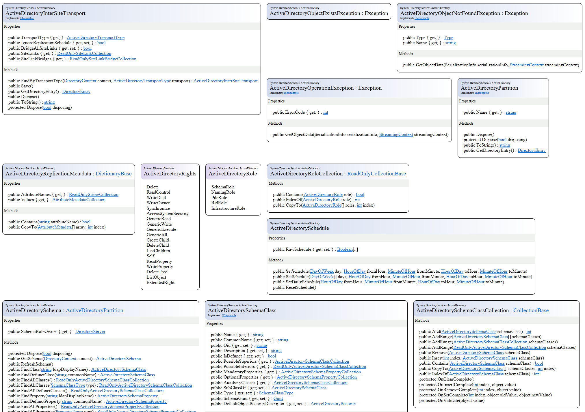

# .NET Object Model Diagram Generator

A cross-platform Roslyn-based tool that generates an object model diagram of a set of C# source files and/or .NET assemblies

## Sponsoring

If you like this library and use it a lot, consider sponsoring me. Anything helps and encourages me to keep going.

See here for details: https://github.com/sponsors/dotMorten


### Install

Run the following command from commandline (requires .NET Core 2.1 installed):
```
dotnet tool install --global dotMorten.OmdGenerator
```


### Usage:
```
generateomd /source=[source folder] /compareSource=[oldSourceFolder] /gitRepo=[repo path or url] /sourceRef=[commit|branch|tag] /compareRef=[commit|branch|tag] /preprocessors=[defines] /format=[html|image] /showPrivate /showInternal

Required parameters:
  source            Specifies the folder of source files to include for the object model.
                    Separate with ; for multiple folders
or
  assemblies        Specifies a set of assemblies to include for the object model.
                    Separate with ; for multiple assemblies, or use wildcards
				
Optional parameters:
  compareSource     Specifies a folder of old source to compare and generate a diff model
                    This can be useful for finding API changes or compare branches
  gitRepo           Specifies a local git repository path or remote git URL to resolve source paths from when using /sourceRef or /compareRef
  sourceRef         Specifies the git commit, branch, or tag to use for the source side of a diff
  compareRef        Specifies the git commit, branch, or tag to compare the current source or /sourceRef against
  compareAssemblies Specifies a set of old assemblies to compare and generate a adiff model.
                    Separate with; for multiple assemblies, or use wildcards
  format            Format to generate: 
                       'html' a single html output (html is default)
                       'md' for markdown you can copy-paste to for instance GitHub.
		       Specify multiple with a semicolon seperator, and use an output filename without extension
  preprocessors     Define a set of preprocessors values. Use ; to separate multiple
  exclude           Defines one or more strings that can't be part of the path Ie '*/Samples/*;*/UnitTests/*'
                    (use forward slash for folder separators)
  regexfilter       Defines a regular expression for filtering on full file names in the source
  showPrivate       Show private members (default is false)
  showInternal      Show internal members (default is false)
  output            Filename to write the output to (extension is optional, but exclude the extension if you specify multiple formats)
  nugetDependencies Dependency package ID patterns to include for /nuget and /compareNuget.
                    Separate with ; for multiple patterns and prefix with ! to exclude a package or subtree.
```


### NuGet
As an alternative you can also reference a [NuGet package](https://www.nuget.org/packages/dotMorten.OmdGenerator/) to your class library, and set up a post-build script to generate an Object Model Diagram HTML file:

```
Install-Package dotMorten.OmdGenerator 
```

Add the following to your project:
```xml
  <Target Name="GenerateObjectModel" AfterTargets="Compile">
    <Exec Command="dotnet &quot;$(DotNetOMDGeneratorToolPath)&quot; /source=&quot;@(Compile)&quot; /preprocessors=&quot;$(DefineConstants)&quot; /output=&quot;$(OutputPath)$(TargetName)&quot;" WorkingDirectory="$(ProjectDir)" />
  </Target>
 
```


An example of a generated output for all of .NET Core can be found [here](http://www.sharpgis.net/Tests/corefx.html).

It can also be used to compare two folders (for instance two separate branches) and only show changes to the API. [Here's an example of .NET CoreFX v2.0 vs Master](http://www.sharpgis.net/Tests/corefx_new.html).

[](http://www.sharpgis.net/Tests/corefx.html)


### Examples

Generate OMD for .NET Core FX source code, and ignore ref and test folders:
```
generateomd /source=c:\github\dotnet\corefx\src /exclude="*/ref/*;*/tests/*;*/perftests/*"
```

Compare .NET CoreFX Master with v2.0.0 repo branches directly from their Github zipped downloads:

```
generateomd /source=https://github.com/dotnet/corefx/archive/master.zip /compareSource=https://github.com/dotnet/corefx/archive/release/2.0.0.zip /exclude="*/ref/*;*/tests/*;*/perftests/*"
```

Compare the current checkout against a tagged release from the same git repository:
```
generateomd /source=c:\github\dotnet\runtime\src\libraries\System.Text.Json\src /compareRef=v8.0.0
```

Compare two commits from a remote git repository by resolving the selected repo-relative source path from both refs:
```
generateomd /source=src/libraries/System.Text.Json/src /gitRepo=https://github.com/dotnet/runtime.git /sourceRef=9f4f4cf /compareRef=v8.0.0
```

What's new in Xamarin.Forms? Compare assemblies from the nuget cache:
```
generateomd /assemblies=%USERPROFILE%\.nuget\packages\xamarin.forms\3.3.0.912540\lib\netstandard2.0\*.dll /compareAsssemblies=%USERPROFILE%\.nuget\packages\xamarin.forms\3.2.0.871581\lib\netstandard2.0\*.dll
```

Compare a meta package and include only matching dependency packages in the analysis:
```
generateomd /nuget=Microsoft.WindowsAppSDK:1.0.0 /compareNuget=Microsoft.WindowsAppSDK:0.8.0 /tfm=net8.0-windows10.0.19041.0 /nugetDependencies="Microsoft.WindowsAppSDK.*;!Microsoft.WindowsAppSDK.Tests.*"
```

### GitHub Actions: comment PR API changes

You can use the git ref comparison support in a pull request workflow to generate the markdown diff between the PR head commit and the PR base commit, then post the result as a PR comment.

In the workflow below:
- `/source` is the repo-relative path to the C# source you want to analyze.
- `sourceRef` is the PR head SHA.
- `compareRef` is the PR base SHA.
- The comment is only created or updated when the generated markdown contains at least one changed namespace/type.

```yaml
name: PR API diff

on:
  pull_request:
    types: [opened, synchronize, reopened]

permissions:
  contents: read
  pull-requests: write

jobs:
  api-diff:
    runs-on: ubuntu-latest

    steps:
      - name: Check out repository
        uses: actions/checkout@v4
        with:
          fetch-depth: 0

      - name: Set up .NET
        uses: actions/setup-dotnet@v4
        with:
          dotnet-version: 8.0.x

      - name: Install generator
        run: dotnet tool install --global dotMorten.OmdGenerator

      - name: Generate API diff
        shell: bash
        run: |
          generateomd \
            /source=src/MyLibrary \
            /gitRepo=${{ github.server_url }}/${{ github.repository }} \
            /sourceRef=${{ github.event.pull_request.head.sha }} \
            /compareRef=${{ github.event.pull_request.base.sha }} \
            /format=md \
            /output=api-diff

      - name: Check whether API changes were found
        id: api_diff
        shell: bash
        run: |
          if grep -q '^namespace ' api-diff.md; then
            echo "has_changes=true" >> "$GITHUB_OUTPUT"
          else
            echo "has_changes=false" >> "$GITHUB_OUTPUT"
          fi

      - name: Create or update PR comment
        if: steps.api_diff.outputs.has_changes == 'true'
        uses: actions/github-script@v7
        env:
          COMMENT_MARKER: <!-- dotnet-omd-api-diff -->
        with:
          github-token: ${{ secrets.GITHUB_TOKEN }}
          script: |
            const fs = require('fs');
            const marker = process.env.COMMENT_MARKER;
            const diff = fs.readFileSync('api-diff.md', 'utf8').trim();
            const body = [
              marker,
              '## API changes',
              '',
              diff
            ].join('\n');

            const { owner, repo } = context.repo;
            const issue_number = context.payload.pull_request.number;

            const comments = await github.paginate(github.rest.issues.listComments, {
              owner,
              repo,
              issue_number,
              per_page: 100
            });

            const existing = comments.find(comment =>
              comment.user.type === 'Bot' && comment.body.includes(marker));

            if (existing) {
              await github.rest.issues.updateComment({
                owner,
                repo,
                comment_id: existing.id,
                body
              });
            } else {
              await github.rest.issues.createComment({
                owner,
                repo,
                issue_number,
                body
              });
            }
```

If you want the comment to cover multiple source roots, separate them with semicolons in `/source`, for example `/source=src/MyLibrary;src/MyOtherLibrary`.

If your PRs come from forks and you want to comment on those PRs too, you may need a `pull_request_target` workflow instead of `pull_request`. Use that carefully, since it runs with broader repository permissions.
